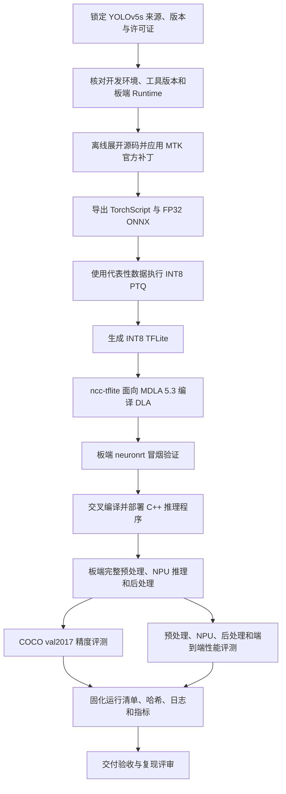

# Genio 720/MT8189 部署 YOLOv5s 总览

## 1. 文档目的

本文以本项目已经完成的 YOLOv5s 为唯一示例,说明模型从来源锁定、转换、INT8 量化、DLA 编译、Genio 720 板端部署,到精度与性能验收的完整流程.

本文不扩展到 Genio 5100、YOLOv5n、YOLOv8 或其他模型.二级文档给出各阶段的具体输入、命令、产物、通过标准和排障入口.

## 2. 目标范围

| 项目 | 本文范围 |
| --- | --- |
| 开发板 | MediaTek Genio 720 EVK |
| SoC | MT8391/MT8189 |
| NPU | NeuroPilot 8、MDLA 5.3 |
| 模型 | Ultralytics YOLOv5s v7.0 |
| 任务 | COCO 80 类目标检测 |
| 输入 | `1×3×640×640`,RGB |
| 量化方式 | INT8 PTQ |
| 离线部署格式 | TFLite → DLA |
| 板端应用 | C++ 完成 JPEG 读取、letterbox、量化、NPU 推理、解码、NMS 和坐标回映 |
| 正式精度集 | COCO val2017,5000 张图片 |

## 3. 三端职责

| 环境 | 主要职责 | 不承担的工作 |
| --- | --- | --- |
| Windows 本地工作区 | 文档和代码维护、Git 同步、模型权重人工准备 | 不执行正式转换和板端评测 |
| Ubuntu 89 | Docker 工具链、TorchScript/ONNX 导出、INT8 PTQ、NCC 编译、C++ 交叉编译、评测调度 | 不用服务器 GPU 性能代替板端性能 |
| Genio 720 板端 92 | 加载 DLA、真实图片推理、C++ 前后处理、COCO 预测生成、时延和内存采集 | 不在线下载模型或数据集 |

## 4. 完整流程



模型产物流如下：

```text
yolov5s.pt
  → yolov5s.torchscript
  → model_fp32.onnx
  → model_int8.tflite
  → model_int8.dla
  → 板端 C++ 推理结果、COCO 指标和性能证据
```

## 5. 阶段与二级文档

| 阶段 | 核心问题 | 主要产物 | 详细文档 |
| --- | --- | --- | --- |
| 1. 准备与范围确认 | 平台、模型、版本和验收边界是否一致 | 范围表、来源表、目标指标表 | [01_准备与范围确认](g720_yolov5s/01_准备与范围确认.md) |
| 2. 环境与官方链路 | 工具链和板端是否可用 | 环境清单、连通性记录、官方示例记录 | [02_环境搭建与官方链路验证](g720_yolov5s/02_环境搭建与官方链路验证.md) |
| 3. 模型静态检查 | 输入输出、版本、图结构是否可接入 | 模型分析和风险清单 | [03_模型来源与静态检查](g720_yolov5s/03_模型来源与静态检查.md) |
| 4. 量化与编译 | 如何得到适配 MT8189 的 DLA | TorchScript、ONNX、INT8 TFLite、DLA | [04_校准量化与DLA编译](g720_yolov5s/04_校准量化与DLA编译.md) |
| 5. 板端应用 | 如何完成真实 C++ 业务链路 | C++ 程序、部署包、检测结果 | [05_板端部署与C++推理](g720_yolov5s/05_板端部署与C++推理.md) |
| 6. 精度验证 | 精度从哪一级开始变化 | 多后端 COCO 指标和损失分析 | [06_精度一致性验证](g720_yolov5s/06_精度一致性验证.md) |
| 7. 性能验收 | 时间花在哪里,是否可接受 | 分段时延、端到端时延、峰值内存 | [07_性能分析与优化](g720_yolov5s/07_性能分析与优化.md) |
| 8. 排障与交付 | 如何定位问题并证明可复现 | 故障记录、证据清单、验收记录 | [08_故障排查与交付验收](g720_yolov5s/08_故障排查与交付验收.md) |

## 6. MT8189 的关键编译约束

Genio 720/MT8189 使用 NeuroPilot 8 和 MDLA 5.3.本项目已经验证的 NCC 配置为：

```bash
ncc-tflite \
    --arch=mdla5.3 \
    --suppress-output \
    --disallow-bridge \
    model_int8.tflite \
    -o model_int8.dla
```

不能直接照抄部分 MTK 通用 YOLOv5s 页面中的 `--arch=mdla3.0` 示例.该示例面向其他 Genio/MDLA 组合；MT8189 应先依据 MTK 的平台资源表确认 NP 和 MDLA 版本,再以目标板实际加载结果为准.

本项目追加 `--suppress-output --disallow-bridge`,是因为默认输出桥可能被派发到 MT8189 不具备的 EDPA 目标.抑制桥接后输出为 MDLA 原生 NCHW INT8,宽度方向可能存在 16 元素对齐,后处理必须按真实输出布局还原.

## 7. 当前已完成结果

### 7.1 精度

| 后端 | mAP@0.5:0.95 | 说明 |
| --- | ---: | --- |
| PyTorch FP32 | 0.3708 | 本项目统一协议 |
| FP32 ONNX | 0.3709 | 与 PyTorch 基本一致 |
| MTK NPU INT8,板端 C++ 全处理 | 0.3586 | 正式交付结果 |

板端 INT8 相对 ONNX 损失约 `0.0123`,即 `1.23` 个百分点.是否接受该损失应由具体业务门槛决定,不能仅以"模型可以运行"代替精度验收.

### 7.2 性能

| 项目 | 实测结果 |
| --- | ---: |
| 板端 C++ 预处理平均 | 7.716 ms |
| 板端 C++ NPU 平均 | 9.629 ms |
| 板端 C++ 后处理平均 | 16.173 ms |
| 稳态端到端平均 | 33.662 ms |
| 稳态端到端 P95 | 38.009 ms |
| 等效吞吐率 | 约 29.71 FPS |
| 峰值 RSS | 33,224 KiB,约 32.45 MiB |

以上是已完成运行的历史证据.本次文档整理没有重新执行模型转换、编译、板端推理或评测.

## 8. MTK 官网资料导航

| 需要解决的问题 | 优先查阅的 MTK 官方资料 |
| --- | --- |
| Genio AI 软件栈和支持路径是什么 | [IoT AI Hub 总入口](https://genio.mediatek.com/doc/iot-aihub/)；[IoT AI Hub Overview](https://genio.mediatek.com/doc/iot-aihub/ai_hub/overview.html) |
| Genio 720 对应哪一代 NP/MDLA | [AI Development Resources](https://genio.mediatek.com/doc/iot-aihub/ai_hub/related_resource.html) |
| 如何完成 YOLOv5s 转换 | [YOLOv5s Models](https://genio.mediatek.com/doc/iot-aihub/ai_hub/model_zoo/litert_analytical/YOLOv5s.html)；[Model Converter](https://genio.mediatek.com/doc/iot-aihub/ai_hub/ai-workflow/model_converter.html) |
| 如何使用 MTK Converter | [NeuroPilot Converter Tool](https://genio.mediatek.com/doc/iot-aihub/ai_hub/ai-workflow/model_converter/neuropilot_converter_tool.html) |
| 如何检查 tensor、dtype 和图连接 | [Visualizing AI Models](https://genio.mediatek.com/doc/iot-aihub/ai_hub/ai-workflow/model_visualization.html) |
| TFLite 算子是否受 NP8/MDLA 5.3 支持 | [G720 TFLite Supported Operations](https://neuropilot.mediatek.com/sphinx/g720/html/l1_supported_operations/l2_supported_operations/supported_operations.html),访问时可能要求 MOL/授权账号 |
| NCC 和 neuronrt 如何使用 | [Neuron Compiler and Runtime](https://genio.mediatek.com/doc/iot-aihub/ai_hub/ai-workflow/neuron-sdk.html) |
| 遇到不支持算子如何区分阶段 | [Handling Unsupported OP and Models](https://genio.mediatek.com/doc/iot-aihub/ai_hub/ai-workflow/troubleshooting.html) |
| 如何裁剪或改写不支持子图 | [Example: Pruning the Model](https://genio.mediatek.com/doc/iot-aihub/ai_hub/ai-workflow/troubleshooting/prune_model.html) |
| 如何评估转换前后精度 | [Accuracy Evaluation](https://genio.mediatek.com/doc/iot-aihub/ai_hub/ai-workflow/accuracy_evaluation.html) |
| 如何分析 NPU 利用率、带宽和算子耗时 | [NPU Profiler: Neuron Studio](https://genio.mediatek.com/doc/iot-aihub/ai_hub/ai-workflow/neuron_studio.html) |
| 如何查阅 Genio 720 Yocto 快速开始 | [Genio 720 Quick Start Guide](https://genio.mediatek.com/doc/iot-yocto/latest/qsg/qsg_genio_720.html) |
| 官方资料不足时去哪里提问 | [Genio Community](https://genio-community.mediatek.com/) |

## 9. 官网资料的正确使用方法

1. 先在 `AI Development Resources` 确认平台对应关系.本项目目标必须是 Genio 720、NP8、MDLA 5.3.
2. 再查 NP8 的支持算子表.不能用 NP6、MDLA 3.0 或其他 SoC 的算子结论替代.
3. 根据失败阶段选择资料：Converter 报错查转换器,NCC 报错查硬件算子约束,板端加载或运行报错查 Runtime 和系统栈.
4. 保存完整错误日志、算子名、tensor 形状、dtype、工具版本和目标架构.只搜索最后一行错误通常不够.
5. 官网示例用于理解标准流程,项目脚本和目标板实测用于确定实际参数.两者冲突时,先确认官网示例的平台和版本,再以目标平台文档及实际证据为准.

## 10. 完整交付判定

以下条件必须同时满足：

- 来源、版本、许可证和下载地址可追溯.
- TorchScript、ONNX、INT8 TFLite 和 DLA 产物齐全并有哈希.
- DLA 在目标 Genio 720 上真实加载并完成推理.
- C++ 完成正式业务所需的前处理和后处理.
- 精度使用完整评测集,不以校准集或少量图片代替.
- 性能区分预处理、NPU、后处理和端到端,并记录预热条件与峰值内存.
- 每次正式运行具有独立运行 ID、输入清单、输出清单、日志和指标.
- 另一名开发人员能够依据文档复现.

少量样例只证明链路和输出基本合理；`neuronrt` 成功只证明 DLA 基本兼容；NCC 编译成功不证明板端可以加载；这些状态都不能单独称为完整交付.
