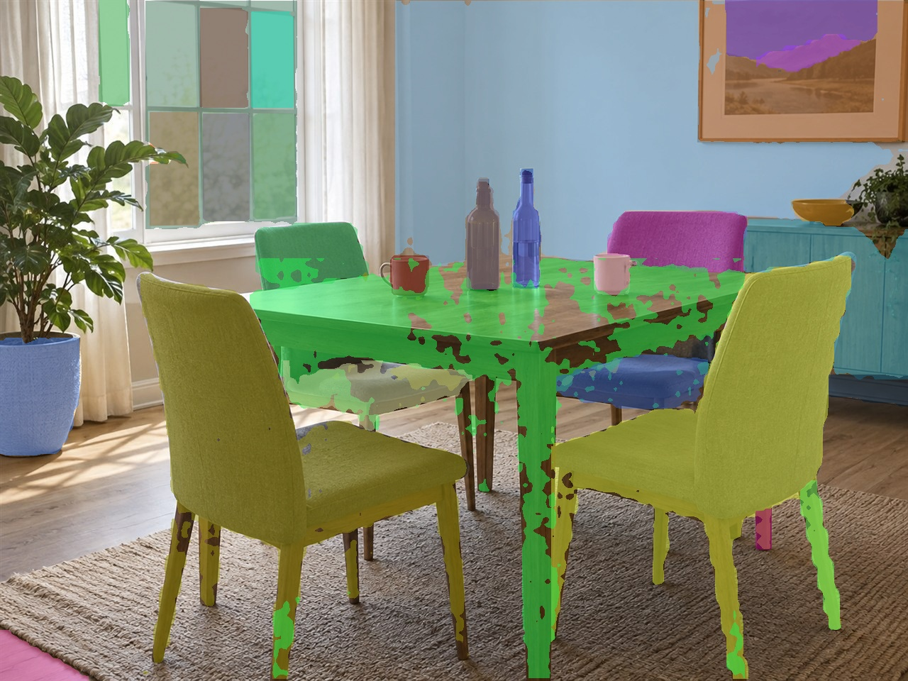
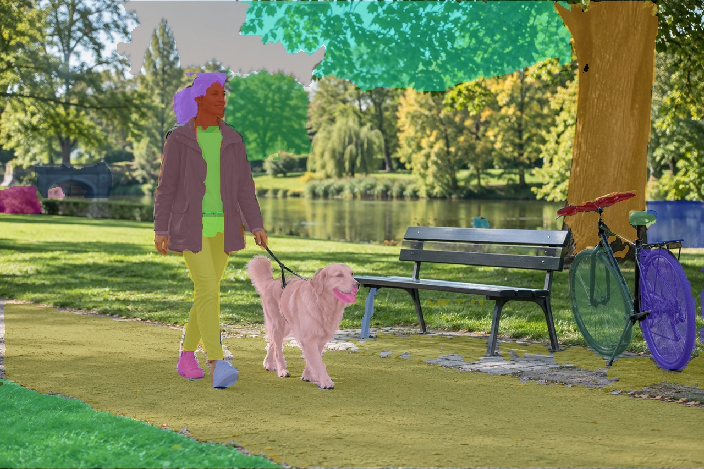

# FastSAM-s / Genio 720

## 模型信息

```text
模型: FastSAM-s
任务: 类别无关实例分割
输入: 1×3×640×640 RGB
输出: 检测头与掩码原型
设备: MediaTek Genio 720 EVK
部署格式: INT8 TFLite → DLA
当前状态: 板端已验证；旧 DLA 校准集重叠，独立校准全量复评中
```

官方 FastSAM-s 权重已完成原始前向、ONNX 导出、16 张校准图 INT8 转换、
Genio 720 DLA 编译和 C++ 硬件推理。旧版 COCO 全量评测的参考端与板端置信度
阈值不一致；现已补齐同协议的 PyTorch、ONNX 参考端，并与旧板端输出核对。
旧 DLA 的 16 张校准图片来自 COCO val2017，旧板端结果只作为历史诊断；
独立校准模型正在全量复评。各端指标见[精度报告](docs/accuracy.md)，
旧 DLA 的常驻性能见[性能报告](docs/benchmark.md)。

## 交付状态

| 环节 | 状态 | 证据 |
| --- | --- | --- |
| 官方权重与原始框架 | 已锁定 | `FastSAM-s.pt` 及源码、权重哈希见下文 |
| 自行导出 ONNX | 已完成 | FP32 产物、原始头数值检查见 `models/` |
| MTK INT8 TFLite / DLA | 已完成 | 16 张校准图版本；产物哈希见模型清单 |
| 板端 Demo 与耗时 | 已完成 | C++ 硬件推理及常驻计时见[性能报告](docs/benchmark.md) |
| COCO val2017 全量精度 | 复评中 | PyTorch、ONNX 全量已完成；旧 DLA 校准集重叠，独立校准 DLA 正在复评 |

采用 FastSAM-s、batch=1、640×640.模型生成类别无关实例掩码,
支持全图输出与轻量点/框提示,暂不接入文本提示所需的 CLIP.
G5100 保持未开始状态.

## 公开三图示例

复用 [YOLOv5s 的三张 CC0 公共输入](../../perception/object_detection/yolov5s/examples/input/public/ASSET_LICENSE.md)，
在 Genio 720 上运行 C++、DLA 与 Neuron Runtime。Demo 使用置信度 0.4、NMS IoU 0.9，
每张最多展示 30 个实例；该展示参数与正式 AP 评测不同，图片不代替 COCO 全量精度。
`examples/output/public/` 平铺保存三张叠加图及对应 JSON；JSON 内含每个掩码的 COCO RLE。

| 典型输入 | 分割实例数 | 板端结果 |
| --- | ---: | --- |
| 城市路口 | 30 | [](examples/output/public/sample_1_segmentation.jpg) |
| 室内餐厅 | 30 | [](examples/output/public/sample_2_segmentation.jpg) |
| 公园人物 | 30 | [](examples/output/public/sample_3_segmentation.jpg) |

机器可读结果分别见 [图 1](examples/output/public/sample_1_segmentation.json)、
[图 2](examples/output/public/sample_2_segmentation.json)和
[图 3](examples/output/public/sample_3_segmentation.json)。

## 官方资源准备

- 模型作者: [CASIA-LMC-Lab/FastSAM](https://github.com/CASIA-LMC-Lab/FastSAM).
- 权重: 官方 README 指向的 [FastSAM-s.pt](https://drive.google.com/file/d/10XmSj6mmpmRb8NhXbtiuO9cTTBwR_9SV/view?usp=sharing).
- 导出实现: 复用容器已安装的 [Ultralytics v8.0.111](https://github.com/ultralytics/ultralytics/tree/v8.0.111).
- 下载地址与来源版本见 [source_url.txt](original/source_url.txt).

权重已由用户在本机下载并放到:

```text
D:\code\github\mtk_models\models\navigation\segmentation\fastsam\original\FastSAM-s.pt
```

文件大小为 23,832,055 bytes,本机和 89 的 SHA-256 均为
`e9034d7478a8e9d1bfb57b51592e521a253287c7cdcf79258f61ea6d68584a0d`.
`download_original.sh` 只校验离线文件,不会发起下载.
该哈希来自本次实际文件,不是上游公布的校验值.

## 转换与编译

以下命令在 89 的现有 `hhl_g720_8011` 容器执行.不升级共享容器依赖.
权重哈希填写在核验后的环境变量中,不能保留示例占位文字.

```bash
cd /data/users/hailong.he/github/mtk_models
export FASTSAM_WEIGHTS_SHA256='e9034d7478a8e9d1bfb57b51592e521a253287c7cdcf79258f61ea6d68584a0d'
export FASTSAM_IMAGE='/data/users/hailong.he/github/mtk_models/models/perception/object_detection/yolov5s/examples/input/public/000000000001.jpg'
export FASTSAM_CALIBRATION_DIR='/data/users/hailong.he/nas_smb/Datasets/open_source/raw/ILSVRC2012/val'
bash models/navigation/segmentation/fastsam/deploy/download_original.sh
bash models/navigation/segmentation/fastsam/deploy/convert.sh
bash models/navigation/segmentation/fastsam/deploy/build.sh
```

2026-09-23 冒烟转换使用了 COCO val2017 的 16 张图片校准，和正式评测集重叠；
该旧 DLA 仅保留为历史对照。上述脚本默认使用独立 ImageNet 图片 100 张，
并核对所选图片 SHA-256 与已保存的 COCO val2017 全量清单没有重叠。
执行后会生成新的模型哈希，不能与旧结果混用。

89 宿主交叉编译 C++ 板端程序:

```bash
bash models/navigation/segmentation/fastsam/deploy/build_board_cpp.sh
```

导出 opset 13,10 个原始输出分别保留三个尺度的框 logits、分数 logits、
掩码系数及原型.DFL、NMS 和掩码还原在 CPU 完成,不编入 DLA.
原型分支包含转置卷积,其 MTK 转换与 MDLA 支持仍需真实编译核实.
编译参数采用 Genio 720 已有流程的 `--arch=mdla5.3 --suppress-output --disallow-bridge`.

## 板端验证

先核实 92 的 SSH 主机密钥和 Python 依赖.以下命令在 89 宿主执行,
`FASTSAM_IMAGE` 必须与导出基线使用的图片相同:

```bash
cd /data/users/hailong.he/github/mtk_models
export FASTSAM_IMAGE='/data/users/hailong.he/github/mtk_models/models/perception/object_detection/yolov5s/examples/input/public/000000000001.jpg'
export FASTSAM_RUN_ID="$(date +%Y%m%d_%H%M%S)"
bash models/navigation/segmentation/fastsam/deploy/deploy_board.sh
```

流程在 `/root/hailong.he/open_models/fastsam/runs/<run_id>` 由 C++ 执行单次 NPU 推理,
生成逐实例掩码、叠加图、C++ 耗时与运行日志.正式 PyTorch/ONNX/NPU 同图精度
对照是后续独立评测,不能把这次冒烟当作数值一致性结论.
输出保存在 `examples/output/runs/<run_id>`; 同名板端目录存在时拒绝覆盖.
冒烟成功仍需审核掩码图和日志,不能单凭 Runtime 加载成功得出精度结论.

详细说明: [Demo](deploy/inference_demo/README.md)、[精度](docs/accuracy.md)、
[性能](docs/benchmark.md)、[模型卡](model_card.md).

## 正式交付待办

- 补充原始框架与板端同协议全量精度对照.
- 在板端同一 C++ Runtime 实例中完成预热和重复性能测试.
- 需要时扩展文本提示所用 CLIP,并单独验证 G5100.

## 板端冒烟前置检查

2026-09-23: 用户确认刷机后的 92 开发板 RSA 指纹
`SHA256:zU7LkySuztN9I7hdCEP4DMYBl743C28KfxiZsvmE9Rk`.
89 重新扫描得到相同指纹后更新 SSH 记录,严格主机密钥检查下成功连接.
板端内核为 `6.6.137-mtk+ga246e0c68c39-g429091ed5965`,
Python 可导入 OpenCV 4.9.0、NumPy 1.26.4 和 ONNX Runtime 1.20.2;
`neuronrt -v` 报告 8.2.16.这些仅证明环境组件可用,
模型硬件推理证据见 [2026-09-23 板端冒烟报告](docs/board_smoke_20260923.md).

## 静态检查记录

2026-09-22: 6 个 Python 文件通过 AST 语法解析,4 个 Shell 脚本通过 `bash -n`.
FastSAM 注册条目和目录必需文件检查通过。当时全仓 `tools/check_registry.py` 因
Whisper 历史状态 `board_validated` 不在允许集合中失败；该状态现已修正为 `board_verified`。
这些检查本身不代表模型执行;真实模型证据见上述冒烟报告.

## 新镜像全量复测入口

在 Ubuntu89 宿主机运行 `EVAL_RUN_ID=<新ID> bash deploy/run_full_accuracy.sh`。
89 编译 DLA 和 C++ 程序，92 对 COCO val2017 全部 5000 张图片计算**类别无关**
实例分割 AP：把标注中 80 个类别合并为一个 `object` 类，不与标准 80 类 segm AP
直接比较。报告保留在 `/root/hailong.he/open_models/fastsam/eval/<新ID>/report/`。
`20260928_fastsam_full_v1` 已在 92 完成 5000 张全量评测，结果见
[板端报告](results/full_accuracy/20260928_fastsam_full_v1/summary.json)：
类别无关 segm AR@100 为 0.370，NPU 平均 14.88 ms/张，
逐图端到端平均 142.97 ms/张。端到端计时包含逐图重新加载模型，
不可当作常驻模型吞吐。用户手动保存并上传报告后，
再以相同 `EVAL_RUN_ID` 执行 `CONFIRM_RESULTS_UPLOADED=1 bash deploy/cleanup_full_accuracy.sh`。
同协议的官方 PyTorch、FP32 ONNX 和板端 segm AR@100 分别为 0.391、0.390、
0.370；旧 ONNX 阈值 0.4 的 AP 0.05210 保留为历史诊断记录。
各端后处理边界和剩余差异见[精度报告](docs/accuracy.md)。
测试和清理是两次独立执行，测试脚本不自动清理本次模型及报告。

FastSAM 全量数据由用户放在 92 的
`/root/hailong.he/datasets/coco/val2017/images/`（5000 张 JPG）与
`/root/hailong.he/datasets/coco/val2017/annotations/instances_val2017.json`。
板端由 shell 逐图调用 C++ 完成预处理与 NPU 推理，Python 仅将预测掩码编码为
COCO RLE 并计算分割 AP。指标计算需 `cv2`、`numpy` 和 `pycocotools`；入口先检查这些条件，
不会自动下载数据或安装依赖。中断后使用同一 `EVAL_RUN_ID` 加
`EVAL_RESUME=1` 续跑；每张图保留 COCO RLE 检查点，转换完成后的逐图 PNG
和张量临时目录会自动移除，全量预测、日志和报告保留供用户检查与清理。
如中断时留下 `raw/<图片ID>/`，先人工检查并删除该目录后再续跑。
板端 C++ 每张图重新加载模型，报告的 NPU 耗时仅计 Runtime 推理调用，
端到端耗时含模型加载，均非预热后的常驻模型性能。
