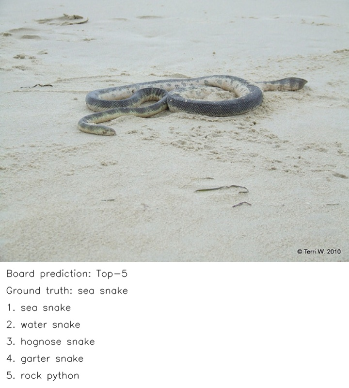
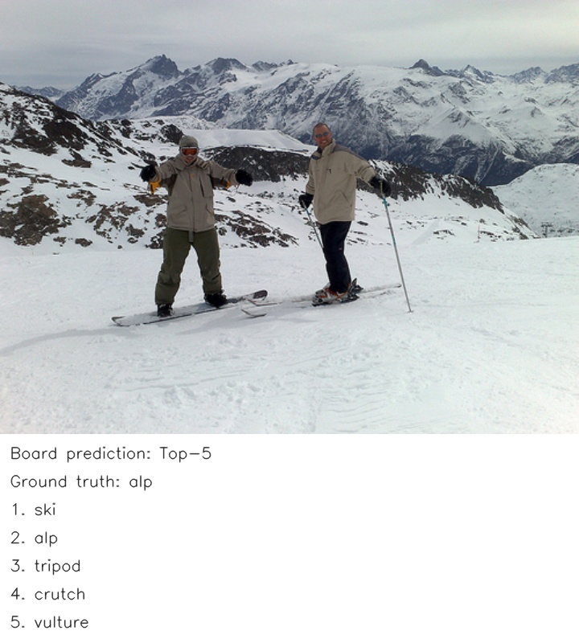
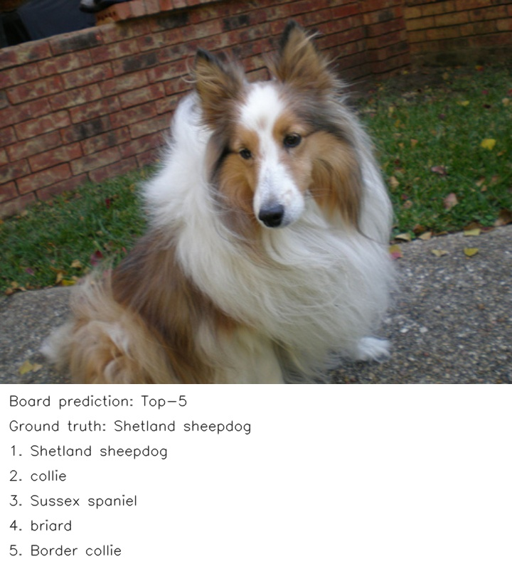

# ViT-Base Patch16 224

ImageNet-1K 图像分类，输入为 224×224 RGB 图像。正式上游为 PyTorch Vision v0.15.1，来源见[模型卡](model_card.md)。

量化方式: INT8 训练后量化 (PTQ),采用逐输出通道权重量化。

## 第一步: 编译并上传

所有配置均在脚本顶部,按模型与校准数据、产物与临时目录、板端地址与数据、ONNX 精度数据、编译环境分组.脚本已填写当前部署环境的路径,使用时按注释调整等号右侧的值; 编译主机和 Docker 须能访问相同数据,板端路径独立配置.

在 [run.sh](deploy/run.sh) 顶部填写以下路径:

| 配置 | 内容 |
| --- | --- |
| `MODEL_ONNX` | 待量化的 MTK 兼容 ONNX 文件 |
| `ONNX_DATASET_DIR` | 编译主机上的 ImageNet 验证集根目录 |
| `CALIBRATION_DIR` | 校准图片目录,使用验证集中的 `val/` 或 `ILSVRC2012_img_val/` |
| `BOARD_HOST` | 板端 SSH 用户和地址 |
| `BOARD_DATASET_DIR` | 板端 ImageNet 验证集根目录 |
| `BOARD_DEPLOY_DIR` | 板端模型与程序部署目录 |

模型、校准数据和 ONNX 评测数据必须同时对编译主机与 Docker 可见。模型产物写入 `MODEL_OUTPUT_DIR`,默认使用本模型的 `models/` 目录。当前校准从按文件名排序的第 1001 张图片开始使用 100 张图片。

编译主机的验证集图片目录支持 `val/` 或解压后的 `ILSVRC2012_img_val/`,根目录需有 `val_labels_0based.txt`。标签由官方 devkit 的 `meta.mat` 和验证集标签映射为 TorchVision 的 0–999 类别编号,不能直接将官方编号减 1。

在编译主机的本模型目录运行:

```bash
bash deploy/run.sh
```

脚本在 Docker 中量化并编译 DLA、评测 ONNX 全量 Top-1,在编译主机交叉编译板端 C++ 程序,然后上传模型、程序与实测 ONNX 基准。Docker 需安装 ONNX Runtime、NumPy、OpenCV 和 tqdm。

## 第二步: 开发板测试

登录脚本中配置的 `BOARD_HOST`,执行第一步打印的板端命令。也可进入 `BOARD_DEPLOY_DIR` 对应的实际目录运行:

```bash
bash run.sh
```

## 数据与精度评测

ViT 默认执行 ImageNet 全量测试,无需额外参数。编译主机与板端均使用相同的 50000 张验证图片和零基类别标签:

```text
数据集根目录/
├── val/ 或 ILSVRC2012_img_val/
│   ├── ILSVRC2012_val_00000001.JPEG
│   ├── ...
│   └── ILSVRC2012_val_00050000.JPEG
└── val_labels_0based.txt
```

板端通过 C++ 完成图片预处理和 NPU 推理,计算 Top-1、NPU 平均耗时、推理进程峰值 RSS 与相对 ONNX 的精度变化。板端需安装 Python 3、NumPy 和 OpenCV。

结果写入 `BOARD_RESULTS_DIR/<运行编号>/summary.json`,默认位于部署目录的 `results/`。成功后保留汇总和少量效果示例; 失败时保留现场。将结果上传到本模型的 `results/summary.json` 后更新 README。

## 当前测试结果

待上传本模型的 `results/summary.json` 后更新。只记录板端 NPU 平均耗时、推理进程峰值 RSS (MiB)、任务核心精度、同协议 ONNX 参考精度和精度变化。峰值 RSS 包含运行库及前后处理,不代表 NPU 专用内存。

## 效果示例

原图下方显示板端 Top-1 与 Top-5 类别排序.

输入已放在 `examples/input/`,来源和样本对应关系见 [samples.json](examples/input/samples.json).

全量测试自动复用选定样本的板端预测,生成少量效果文件到本次结果目录的 `examples/output/`.
以下三张效果来自本次板端实际推理,复用已完成样本的预测,未额外运行模型.全量精度与性能以测试完成后的 `summary.json` 为准.

### 示例 1: 海蛇



### 示例 2: 雪山



### 示例 3: 牧羊犬



## 板端部署结构

第一步上传到 `BOARD_DEPLOY_DIR` 后的布局统一为:

```text
部署目录/
├── run.sh
├── board_paths.conf
├── models/              # 模型与推理所需参数.
├── board/               # 板端程序、评测代码及必要依赖.
├── examples/input/      # 少量示例输入及来源清单.
└── results/             # 汇总及少量效果示例.
```

全量测试结果保存在 `BOARD_RESULTS_DIR/<运行编号>/summary.json`.成功后保留汇总和少量效果示例,失败时保留本次工作目录.将汇总上传为本模型的 `results/summary.json` 后更新 README.
## 文件结构

- `deploy/run.sh`: 编译上传和板端测试的唯一 Shell 入口.
- `deploy/host/`: 编译主机使用的导出、转换与辅助工具.
- `deploy/board/`: 板端程序源码、预处理和评测代码.
- `models/`: 原始权重、转换产物与来源说明; 必要的上游源码放在 `models/upstream/`.
- `examples/`: 少量固定输入与实际板端效果输出.
- `results/summary.json`: 上传后的最新测试汇总.
