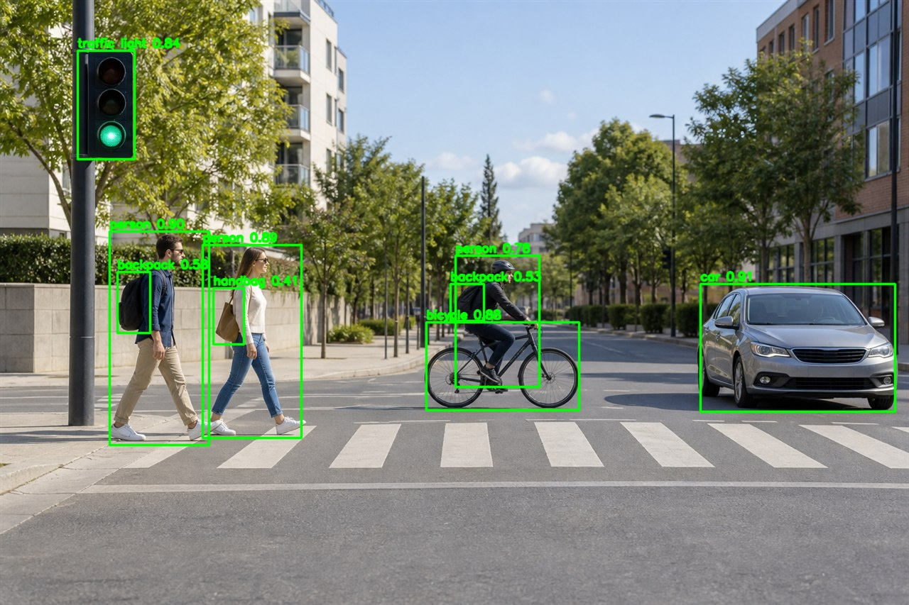
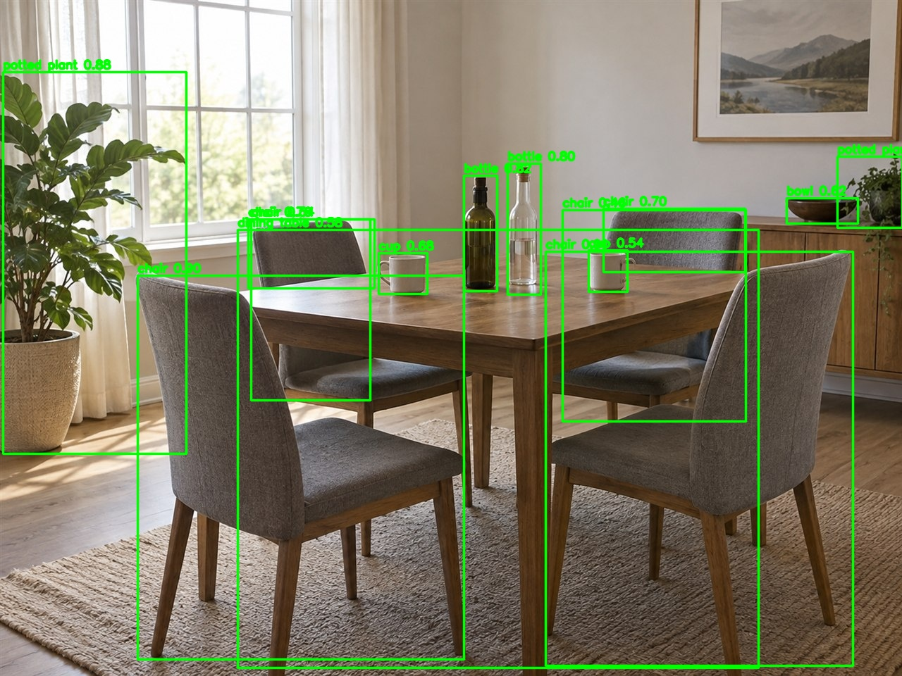
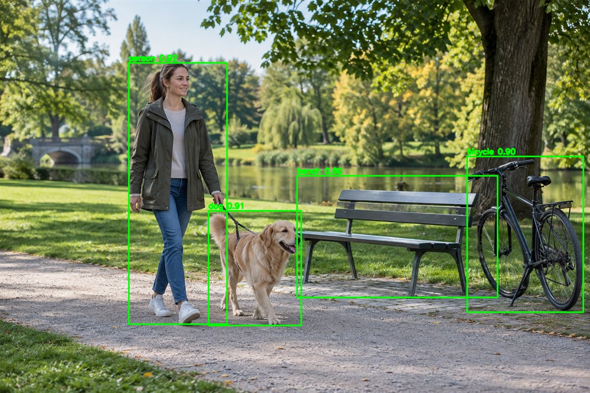

# YOLOv5s

## 模型信息

```text
模型: YOLOv5s
任务: COCO 80 类目标检测
输入: 1×3×640×640 RGB
输出: 3 个检测头
设备: MediaTek Genio 720 EVK
部署格式: INT8 TFLite → DLA
当前状态: 完整交付
```

Qualcomm Hugging Face 页面用于对标交付形式；由于其页面当前描述的是 YOLOv5-M 且不分发
预导出资产,本模型采用 Ultralytics YOLOv5s 上游权重,并按照 MTK 官方 YOLOv5s 流程转换.

## 本机离线输入

YOLOv5s 权重属于模型文件,必须由用户手动下载到本机工作区.正确的 Ultralytics v7.0
Release 地址为：

<https://github.com/ultralytics/yolov5/releases/download/v7.0/yolov5s.pt>

本机目标位置：

```text
D:\code\github\mtk_models\models\perception\object_detection\yolov5s\models\yolov5s.pt
```

不要使用已失效的 `ultralytics/assets/releases/download/v7.0/yolov5s.pt`.固定提交
`485da42273839d20ea6bdaf142fd02c1027aba61` 的 YOLOv5 源码包和 MTK 官方补丁包体积较小,
已在本机准备并纳入 Git：

| 文件 | SHA-256 |
| --- | --- |
| `original/yolov5-485da42.zip` | `ba30792a44660ae95bcc1e2fee1ca369b98871893894fc68ac2b69e26cdc7dae` |
| `original/model_conversion_YOLOv5s_example_20240916.zip` | `8cb3ee3f7059a522e47fecd1be6983404e455e3f7069c19e9fe0a750df6a6fb7` |
| `models/yolov5s.pt` | `8b3b748c1e592ddd8868022e8732fde20025197328490623cc16c6f24d0782ee` |

89 服务器和 92 开发板不得联网下载上述模型、数据集或源码文件.用户完成 GitHub 同步并
手动放置权重后,才能继续下面的流程.Docker 镜像和 Python 系统依赖仍可在 89 的 Docker
环境内按项目约定安装.

## 服务器执行流程

89 宿主机只在仓库目录执行命令：

```bash
cd /data/users/hailong.he/github/mtk_models
docker exec -it hhl_g720_8011 bash
```

宿主机仓库以完全相同的绝对路径映射到 Docker.进入容器后执行：

```bash
cd /data/users/hailong.he/github/mtk_models/models/perception/object_detection/yolov5s
bash ./deploy/download_original.sh
bash ./deploy/convert.sh
bash ./deploy/build.sh
bash ./deploy/deploy_board.sh
```

`download_original.sh` 名称为兼容统一交付结构而保留,实际只执行 SHA-256 校验、离线解压和
MTK 补丁应用,不包含任何网络下载.`convert.sh` 按 MTK 官方 NeuroPilot Converter 流程,
先导出 TorchScript 和 FP32 ONNX,再从 TorchScript 执行 INT8 PTQ.

`deploy/constraints-py311.txt` 固定 Python 3.11 转换依赖,防止上游宽松版本范围将 NumPy
升级到 MTK Converter 不支持的 2.x,或将 Ultralytics 升级到移除 `ultralytics.yolo`
命名空间的新版本.转换开始前会执行 `pip check` 和关键模块导入检查.

PyTorch 2.0.0 CUDA 11.8 使用 89 的 NVIDIA GPU 完成 TorchScript/ONNX 导出,PyTorch 和
ONNX 基线精度评测也使用 GPU.MTK Converter 8.16.0 的公开接口没有 CUDA/GPU 选项,
因此 INT8 PTQ 和 NCC 编译仍由 CPU 执行,不能将这两步描述为 GPU 加速.

每一步会检查上一步产物,失败后立即停止.`convert.sh` 需要
`/data/users/hailong.he/nas_smb/Datasets/open_source/raw/coco/coco_val2017/images`
作为校准图片来源；正式精度使用完整 COCO val2017,不复用校准结果冒充 mAP.

## MT8189 编译约束（重要）

MT8189 (Genio 720) 的 NPU 是 MDLA 5.3,且**没有 EDPA 硬件**（板端不存在
`libcmdl.so`）；NCC 8.2.31 对 INT8 图输出的 “MDLA → Output 数据转换桥" 默认派发到
EDPA_1_2,导致板端 neuronrt 8.2.16 加载失败（`Found an unsupported target: EDPA_1_2`）.
旧 `--arch=mdla3.0` 产物同样被板端拒绝（`unsupported target: MDLA_3_0`）.

解决方案（已固化在 `deploy/build.sh`）：

- 使用 `--arch=mdla5.3` 编译.
- 追加 `--suppress-output --disallow-bridge`：抑制 EDPA 桥接,输出为 MDLA 原生
  NCHW INT8,**行 stride 按 16 元素对齐**（W=80/40/20 → 80/48/32）,
  由 `deploy/inference_demo/postprocess_outputs.py` 还原布局.
- 实测原生输出与 CPU 参考 MAE≈1 LSB,属硬件舍入正常差异.

## 精度评测

三后端（PyTorch / ONNX / MTK NPU INT8）共享同一 letterbox 预处理、解码和 NMS,
在 89 宿主机执行：

```bash
cd /data/users/hailong.he/github/mtk_models/models/perception/object_detection/yolov5s/deploy
bash accuracy_eval.sh all   # 也可分阶段: npu|fp32|evaluate
```

正式板端 C++ 评测使用：

```bash
cd /data/users/hailong.he/github/mtk_models/models/perception/object_detection/yolov5s
bash deploy/accuracy_board_cpp.sh
```

该流程要求 92 的 `/root/hailong.he/datasets/coco/val2017` 已有完整 5000 张图片与
`instances_val2017.json`,并安装 AArch64 `pycocotools`.C++ 完成全部前处理、常驻 Runtime
推理和后处理；pycocotools 只读取板端生成的最终预测 JSON 计算标准 COCO 指标,不参与模型
前后处理.脚本回传指标、耗时、峰值 RSS、CPU 调频状态和输入/输出哈希证据,不回传逐图
NPU 原始输出.正式运行要求使用全新的 `EVAL_RUN_ID`,同名本地或板端目录会直接中止,
防止旧结果混入本次评测.

旧分阶段对照流程为：容器内批量生成 COCO val2017 INT8 输入 → 推送 92 板端逐图
`neuronrt` 推理 → 回传原生输出 → 容器内解码 + NMS + pycocotools 计算 mAP.正式板端
C++ 路径不再回传这些原生输出.两条路径在评测前都会检查清单内全部图片均已完成,即使
某张图片没有检测结果也会纳入 COCO 指标.
评测脚本为 `tools/accuracy/yolov5s_val_coco.py`,每次运行使用独立目录
`.eval/yolov5s/runs/<run_id>/`,避免复用其他模型版本的旧结果.`all` 默认创建新运行；
分阶段或中断续跑时必须为各阶段传入同一个 `EVAL_RUN_ID`.冒烟测试可使用
`TOTAL=20 bash accuracy_eval.sh all`,冒烟结果不能覆盖正式全量结果.

## 交付状态

| 环节 | 状态 | 证据 |
| --- | --- | --- |
| 来源锁定 | 已完成 | `original/source_url.txt`、两个固定版本压缩包及 SHA-256 |
| 原始模型 | 已完成 | `models/yolov5s.pt`,14,808,437 bytes,SHA-256 已记录 |
| ONNX | 已完成 | `models/model_fp32.onnx` |
| INT8 TFLite | 已完成 | `models/model_int8.tflite` |
| DLA | 已完成 | `models/model_int8.dla`（mdla5.3 + suppress-output） |
| 板端 Demo | 已完成 | `examples/output/`（detections.json、detected.jpg、性能日志） |
| 正式精度 | 已完成 | `docs/accuracy.md`（板端 C++ 完整处理 5000 张 COCO val2017,INT8 损失 -1.23pt） |
| 正式性能 | 已完成 | `docs/benchmark.md`（板端 C++ 稳态端到端平均 33.66ms、P95 38.01ms；峰值 RSS 33,224 KiB） |

Genio 720 的转换、Demo、板端性能、三后端正式精度和文档证据均已完成,当前状态为
“完整交付".Genio 5100 仍为未开始,不属于本次状态结论.

## 公开三图示例

`examples/input/public/` 提供室外交通、室内家具和公园人物三张项目生成的 CC0-1.0
图片.执行 `bash deploy/generate_examples.sh` 会交叉编译板端 C++ 推理器,
在 Genio 720 完成预处理、NPU 推理、解码和 NMS,并把检测框图片及 JSON 写入
`examples/output/public/`.运行过程显示 1/3 至 3/3 的逐图进度.这些图片只用于结果展示,
不替代完整 COCO val2017 mAP.

| 典型输入 | 检测数量 | 板端结果 |
| --- | ---: | --- |
| 城市路口 | 9 | [](examples/output/public/sample_1_detections.jpg) |
| 室内餐厅 | 14 | [](examples/output/public/sample_2_detections.jpg) |
| 公园人物 | 4 | [](examples/output/public/sample_3_detections.jpg) |

完整机器可读结果见 [`examples/output/public/results.json`](examples/output/public/results.json).

## 全流程验收边界

YOLOv5s 只有同时完成以下项目才视为交付完成：

1. 在 `hhl_g720_8011` 中生成 TorchScript、FP32 ONNX、INT8 TFLite 和 DLA.
2. 在 92 的 Genio 720 EVK 上加载 DLA 并完成真实图片推理和检测框后处理.
3. 报告预处理、纯 NPU、后处理及端到端延迟,并记录峰值内存.
4. 使用同一 COCO val2017 评测集分别测量 PyTorch、ONNX 和 MTK NPU 的 mAP.
5. 计算 ONNX 相对 PyTorch、MTK NPU INT8 相对 ONNX/PyTorch 的精度损失.

少量样例只能证明部署链路和输出合理性,不能替代完整 COCO val2017 精度报告.

板端 Demo 使用当前 TFLite 的实际量化参数生成输入,调用 92 的 `neuronrt 8.2.16` 完成
推理并回传三个检测头.正式板端精度使用交叉编译的 C++ 程序
`deploy/inference_demo/yolov5s_board_eval.cpp`：DLA 只加载一次,JPEG 读取、letterbox、
INT8 量化、Neuron Runtime 推理、MDLA 行对齐输出还原、YOLO 解码和 NMS 全部在 92 完成,
板端直接生成 COCO 预测 JSON、完成清单和逐图耗时.5000 张原始输出不再回传到 89.
