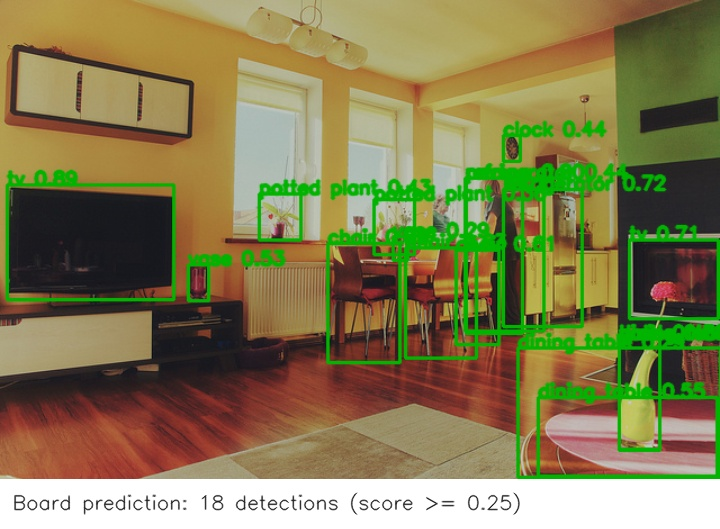
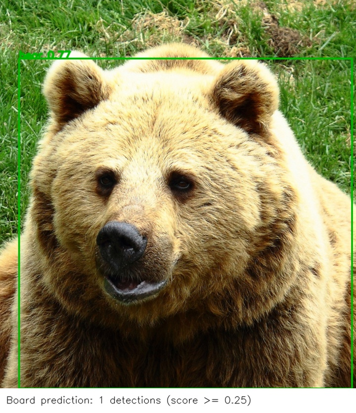
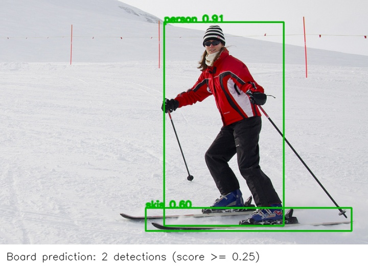

# YOLOv5s · Genio 720

COCO 80 类目标检测。模型来源和许可证见[模型卡](model_card.md)。

## 第一步：编译并上传

在 [run.sh](deploy/run.sh) 顶部填写路径。通常只需确认 `MODEL_WEIGHTS`、填写 `CALIBRATION_DIR` 和 `BOARD_DEPLOY_DIR`，并按需调整 `MODEL_OUTPUT_DIR`、`OUTPUT_DLA`。全量测试再填写 `BOARD_DATASET_DIR`。其余配置仅在 Docker、SDK 或交叉编译环境变化时修改。资源地址见 [source_url.txt](models/source_url.txt)。模型、校准集及产物路径必须同时对编译主机和 Docker 容器可见。

在**编译主机的仓库根目录**运行：

```bash
bash models/perception/object_detection/yolov5s/deploy/run.sh
```

脚本在 Docker 中生成 DLA,自动评测 ONNX FP32 全量精度,在编译主机交叉编译板端 C++ 程序,然后上传文件和实测 FP32 基准。`FP32_IMAGES_DIR` 与 `FP32_ANNOTATIONS` 必须指向与板端相同的 COCO val2017 5000 张图片及标注。校准仅使用其中 100 张图片,与全量精度评测分开。

浮点模型只记录 mAP@0.5:0.95,不测试 PyTorch 精度,不统计编译主机耗时或内存。Docker 需安装 ONNX Runtime、pycocotools、OpenCV、PyTorch、torchvision 和 tqdm; PyTorch 仅用于解码和 NMS。模型产物写入脚本配置的输出目录。脚本不下载模型或数据。

## 第二步：开发板测试

使用脚本中配置的 `BOARD_HOST` 登录开发板，并执行第一步打印的 `[NEXT]` 命令。

默认测试三张示例图；在板端命令末尾加 `full` 执行 COCO 全量测试。结果写入 `BOARD_RESULTS_DIR`，默认位于 `BOARD_DEPLOY_DIR/results`。全量测试要求 `BOARD_DATASET_DIR/images/` 中有 5000 张 COCO val2017 图片、`BOARD_DATASET_DIR/annotations/instances_val2017.json`，板端还需 `pycocotools`。若 SSH 提示主机密钥变化，先核对板端指纹，再更新编译主机上执行脚本用户的 `known_hosts`。

## 当前测试结果

结果来自 [results/summary.json](results/summary.json),运行编号 `20261008_032807_67603`,COCO val2017 全量 5000 张图片。

| 指标 | 本次结果 |
| --- | ---: |
| 板端 NPU 平均推理耗时 | **9.76 ms** |
| 板端推理进程峰值 RSS | **33.23 MiB** |
| ONNX FP32 mAP@0.5:0.95 | **37.09%** |
| 板端 mAP@0.5:0.95 | **35.86%** |
| 精度变化 (百分点) | **-1.23** |

ONNX FP32 与板端精度均来自本次同协议 COCO val2017 全量实测。mAP 以百分比显示并保留两位小数,精度变化按原始数值计算,负数表示下降。`summary.json` 保留完整数值精度,已纳入 Git 管理。

NPU 耗时统计预热后 5000 张图片的 `NeuronRuntime_inference` 调用,不含图片读取、前后处理和 COCOeval。峰值内存为板端 C++ 推理进程峰值 RSS,包含运行库与前后处理,不代表 NPU 专用内存。

全量测试成功后只保留一个 `summary.json`,中间预测和日志自动删除; 失败时保留现场。测试完成后将汇总文件上传到本地 `results/summary.json`,据此更新当前结果。

量化方式: INT8 训练后量化 (PTQ),使用 100 张图片校准.

## 示例输出

三张示例图仅展示检测效果,不参与 COCO 精度评测。

### 示例 1



### 示例 2



### 示例 3



示例输入由项目维护者使用 OpenAI 图像生成工具制作,按 [CC0 1.0](https://creativecommons.org/publicdomain/zero/1.0/) 发布。
